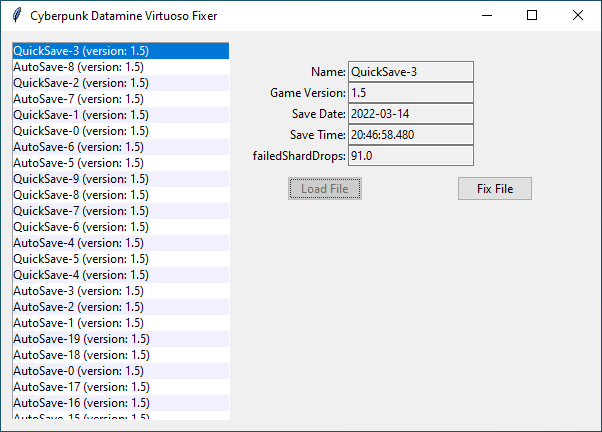

# Cyberpunk Python Hacks

This repository contains python scripts to manipulate Cyberpunk 2077
save files.
To use these scripts you need to install [Python](https://python.org)
first.
By default old save files are backed up at the same directory with name
`backup_1.dat`, `backup_2.dat`, ... .

To fix [Datamine Virtuoso bug](
https://forums.cdprojektred.com/index.php?threads/not-getting-quickhacks-from-access-points.11061788/
) you need to simply run (or double click) `datamine-virtuoso-fixer.pyw`
file.
After loading the save file, it shows `failedShardDrops` field value:

Now you can fix the save file by clicking the `Fix File` button.

# Python Interactive Usage

You can also use these modules directly from command-line to have a
full-featured save file editor in your hand.

For example to fix the bug mentioned before, you can do it this way:

    >>> from cp2077save import SaveFile
    >>> savefile = SaveFile(r"C:\Users\...\QuickSave-3")
    >>> with savefile.nodes.ScriptableSystemsContainer as config:
    ...     dir(config)
    ...
    ['BraindanceSystem', 'CityLightSystem', 'CraftBook',
    'CraftingSystem', 'DataTrackingSystem', 'DistrictManager',
    'DropPointMappinRegistrationData', 'DropPointPackage',
    'DropPointSystem', 'EquipmentSystem', 'EquipmentSystemPlayerData',
    'FastTravelSystem', 'FirstEquipSystem', 'FocusCluesSystem',
    'GameplaySettingsListener', 'GameplaySettingsSystem', 'Hotkey',
    'MarketSystem', 'PlayerDevelopmentData', 'PlayerDevelopmentSystem',
    'PreventionSystem', 'SecSystemDebugger', 'SubCharacterSystem',
    'TimetableCallbackData', 'UIScriptableSystem', 'Vendor',
    'gameFastTravelPointData']
    >>> with savefile.nodes.ScriptableSystemsContainer as config:
    ...     dir(config.DataTrackingSystem)
    ...
    ['achievementsMask', 'bluelinesUseCount', 'defeatedEnemies',
    'downedEnemies', 'downedInTimeDilatation', 'downedWithMelee',
    'downedWithRanged', 'failedShardDrops', 'finishedEnemies',
    'incapacitatedEnemies', 'killedEnemies', 'meleeAttacksMade',
    'npcMeleeBlockedAttacks', 'npcMeleeDeflectedAttacks',
    'npcMeleeLightAttackReceived', 'npcMeleeStrongAttackReceived',
    'quickhacksMade', 'rangedAttacksMade', 'rangedProgress']
    >>> with savefile.nodes.ScriptableSystemsContainer as config:
    ...     config.DataTrackingSystem.failedShardDrops
    ...
    91.0
    >>> with savefile.nodes.ScriptableSystemsContainer as config:
    ...     config.DataTrackingSystem.failedShardDrops = 0
    ...
    >>> savefile.save()

# LICENSE

See [LICENSE](LICENSE).
